# MEmoRy

People move through life too quickly. Most don’t stop to check how they actually feel. Caring for their own emotions becomes an afterthought, and traditional therapy often feels too distant or heavy to approach. Many experience stress, anxiety, or emotional pain, but they can’t name it. They don’t know where it comes from or how to deal with it. Their feelings get buried under noise, routines, and numbness.

**MEmoRy** gives users a simple way to slow down and understand themselves. It lets them chat with AI about their days for diary generation, get AI-generated reflections, track emotional trends, and access meditation content when needed. Everything runs in the browser and stays personal. The goal isn’t to replace therapy, but to offer a quiet space where people can notice their emotions, make sense of them, and take better care of their inner state—one day at a time.

**MEmoRy** is a personal mood tracking and memory recording application that combines daily journaling, emotion visualization, and multimedia experiences. Its main goals are to:
-	Track and manage moods: Provide intuitive feedback on emotional fluctuations through daily records and ratings.
-	Enhance self-awareness: Allow users to review historical data to identify behavioral patterns and emotional triggers.
-	Provide immersive experiences: Use background videos/audio and mindfulness content to help users relax while journaling.
-	Establish inner harmony: Recognizing that all of these emotions, once acknowledged, will transform into precious memories that define our lives and achieve emotional wholeness.

The name **MEmoRy** reflects its core features: EMO (emotion), MEMO (diary), MEMORY, ME, and extends to diaRY and Meditation.

---

## Main Menu

The Main Menu is your entry point to the MEmoRy space. It guides you gently into your personal journey.

### Register / Login
- **Register:** Create your MEmoRy space with a username and password.
- Answer a prerequisite question: List five reasons why you find yourself lovely or why others like you. This helps MEmoRy understand you better.
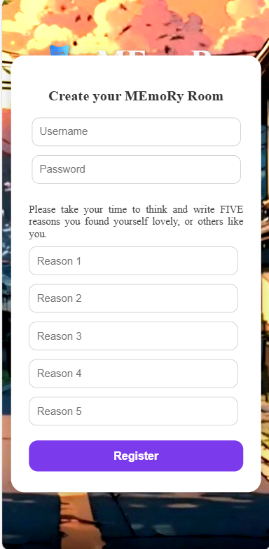

- **Login:** Enter your username and password to access your personal space. Incorrect credentials will trigger an alert to re-enter.
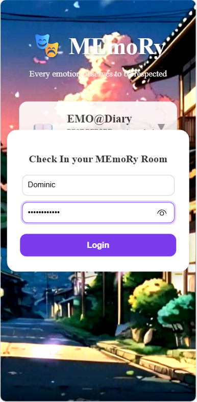

### Interface
- **Emo@Diary** – Explore your emotions through Memo and Memory.
- **Emo@Station** – Self-reflection and meditation through Me and Meditation.
- Options display feature descriptions when clicking the hidden info button.
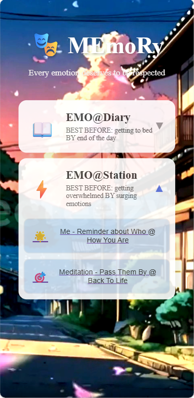

---

## Emo@Diary

### Emo@Diary – Memo

#### Page 1: About Today
Every day is unique, and MEmoRy helps you capture it.
- See the date, day, and weather at a glance.
- Upload a picture that represents today and add a few words describing why this day is special. Let it be your little memory capsule.
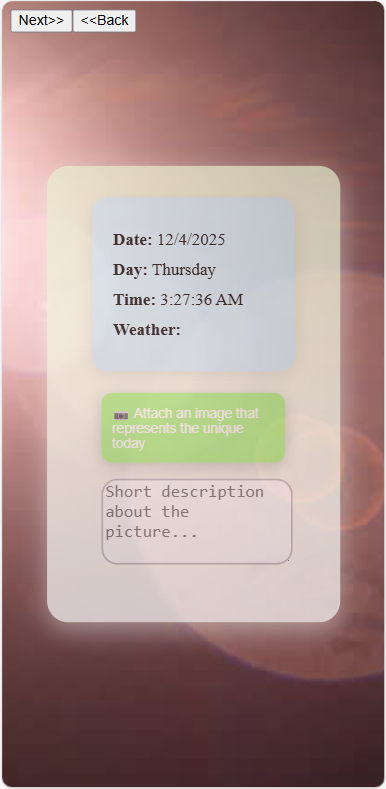

#### Page 2: Negative Emotion Chat
Some days feel heavy. Let it out here.
- Share anything that made you feel sadness, anger, or frustration.
- Click Send. “Listening…” appears while the AI gently guides you to discover the roots of your emotions and what your heart truly needs.
- The background subtly changes to rainy, reflecting the mood and giving space for reflection.


#### Page 3: Positive Emotion Chat
Every joy, big or small, deserves to be shared.
- The background becomes sunny, reflecting lightness and warmth.
- Tell the AI about moments that made you happy today.
- Let the AI be your companion, celebrating with you.
- Click Done when you feel ready to leave the chat.
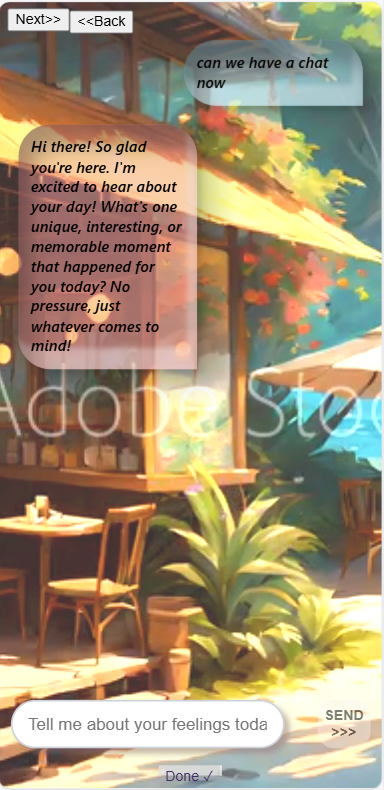


#### Page 4: Self Reflection
- After the day’s chats, AI summarizes your mood and gives it a mood score (0–10).
- A song is recommended based on your mood, ready to play or pause on the player bar. Enjoy it fully.
- Choose a Reflection Card to write a message to your “yesterday self” — a gentle conversation with the you of the past.
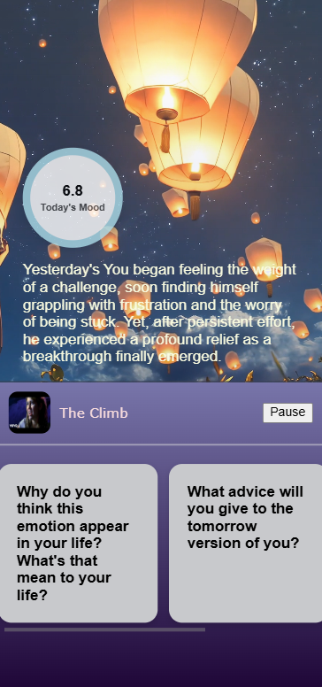

---

### Emo@Diary – Memory
#### Page 1: Quick Glance
- See a quick overview of your last five diaries’ mood scores on an interactive chart.
- Switch between diary summaries with the arrows.
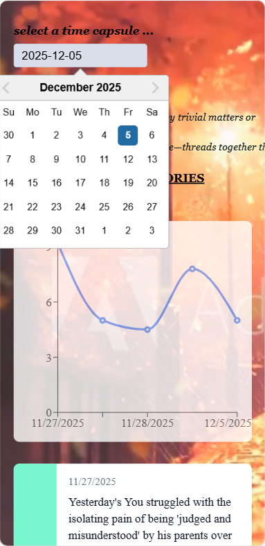

- Pick a date from the calendar for a deep dive.
- If no diary exists for that day, the page stays blank — giving you space for tomorrow’s memories.
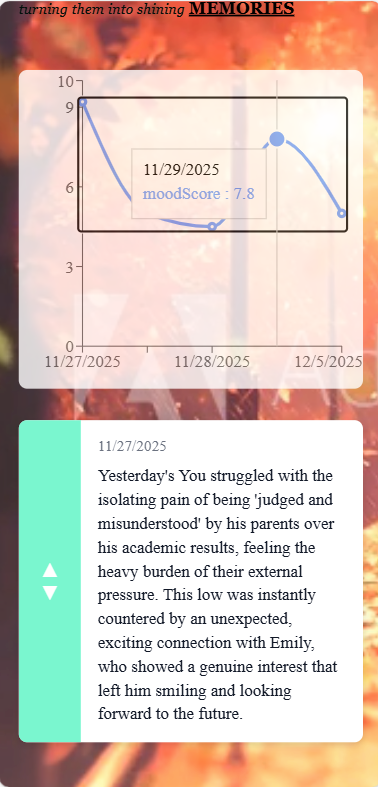

#### Page 2: Deep Dive
- Explore your diary of the day, generated by AI assistant from your chat logs.
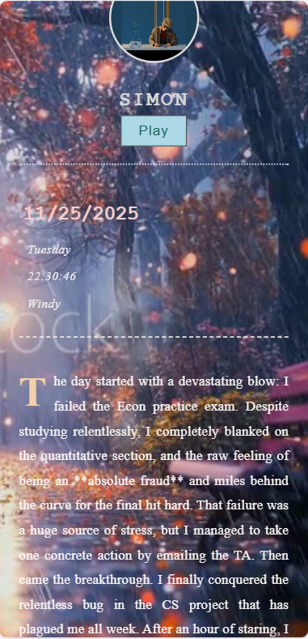

- Feel the sentimental background, listen to the song recommended for that day, and view the picture you uploaded — every detail reflects your unique day.
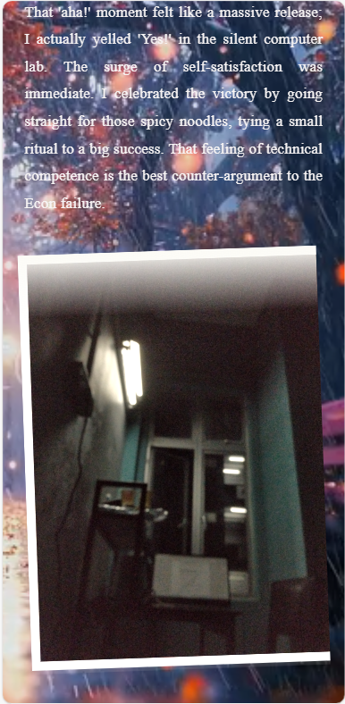
---

## Emo@Station
### Emo@Station – Me
Your personal corner when you feel lost or need reassurance.

#### Modes
- Love ME: Reasons why you or others find you lovely.
- My Wins: Celebrate your achievements, big or small.
- My Quotes: Capture inspiring words that touched you.
- My Tomorrow: Note events you look forward to, keeping hope alive.
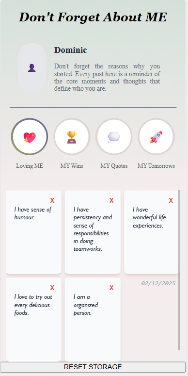

#### Operations
- Click the circle to switch modes.
- Selected mode is highlighted. Click again to upload a new post.
- Delete posts using the “X” at the top-right corner.

---

### Emo@Station – Meditation
When emotions feel overwhelming, find calm here.

#### Pass Them By
- Choose a meditation method and duration.
- Audio guides you through the process, helping you release tension and regain focus.
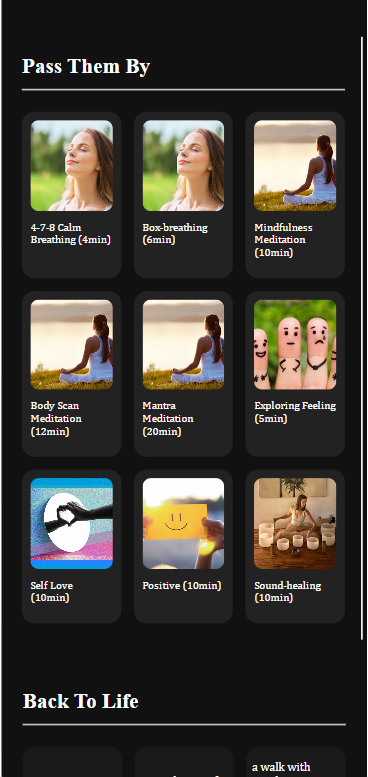

#### Back to Life
- Based on psychology theory, the usual emotion that we encountered last for 4 to 7 minutes.
- Click the "Pick n Go" button below to redirect your attention to new stuffs, for calming yourself down naturally.
- By clicking the card, you can personalised the card into anything you like to do and need less effort. Click again the card to save your edit afterward.
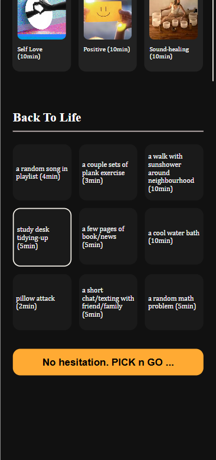


# React + TypeScript + Vite

This template provides a minimal setup to get React working in Vite with HMR and some ESLint rules.

Currently, two official plugins are available:

- [@vitejs/plugin-react](https://github.com/vitejs/vite-plugin-react/blob/main/packages/plugin-react) uses [Babel](https://babeljs.io/) (or [oxc](https://oxc.rs) when used in [rolldown-vite](https://vite.dev/guide/rolldown)) for Fast Refresh
- [@vitejs/plugin-react-swc](https://github.com/vitejs/vite-plugin-react/blob/main/packages/plugin-react-swc) uses [SWC](https://swc.rs/) for Fast Refresh

## React Compiler

The React Compiler is not enabled on this template because of its impact on dev & build performances. To add it, see [this documentation](https://react.dev/learn/react-compiler/installation).

## Expanding the ESLint configuration

If you are developing a production application, we recommend updating the configuration to enable type-aware lint rules:

```js
export default defineConfig([
  globalIgnores(['dist']),
  {
    files: ['**/*.{ts,tsx}'],
    extends: [
      // Other configs...

      // Remove tseslint.configs.recommended and replace with this
      tseslint.configs.recommendedTypeChecked,
      // Alternatively, use this for stricter rules
      tseslint.configs.strictTypeChecked,
      // Optionally, add this for stylistic rules
      tseslint.configs.stylisticTypeChecked,

      // Other configs...
    ],
    languageOptions: {
      parserOptions: {
        project: ['./tsconfig.node.json', './tsconfig.app.json'],
        tsconfigRootDir: import.meta.dirname,
      },
      // other options...
    },
  },
])
```

You can also install [eslint-plugin-react-x](https://github.com/Rel1cx/eslint-react/tree/main/packages/plugins/eslint-plugin-react-x) and [eslint-plugin-react-dom](https://github.com/Rel1cx/eslint-react/tree/main/packages/plugins/eslint-plugin-react-dom) for React-specific lint rules:

```js
// eslint.config.js
import reactX from 'eslint-plugin-react-x'
import reactDom from 'eslint-plugin-react-dom'

export default defineConfig([
  globalIgnores(['dist']),
  {
    files: ['**/*.{ts,tsx}'],
    extends: [
      // Other configs...
      // Enable lint rules for React
      reactX.configs['recommended-typescript'],
      // Enable lint rules for React DOM
      reactDom.configs.recommended,
    ],
    languageOptions: {
      parserOptions: {
        project: ['./tsconfig.node.json', './tsconfig.app.json'],
        tsconfigRootDir: import.meta.dirname,
      },
      // other options...
    },
  },
])
```
